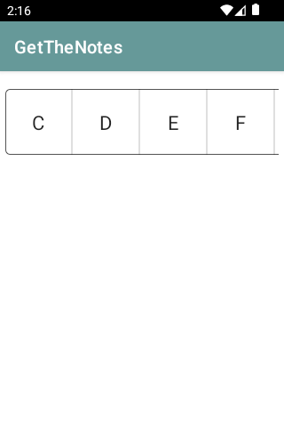
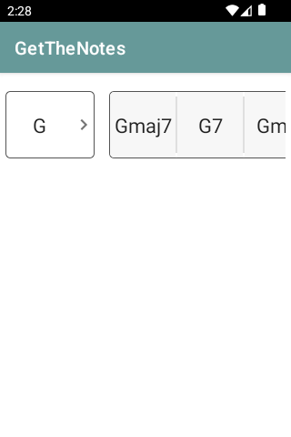
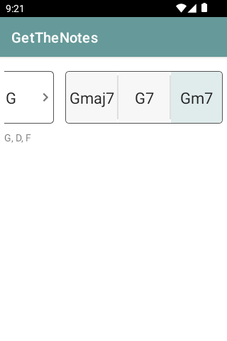
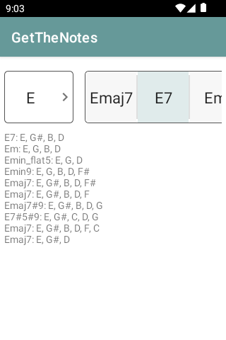

# Improve the usability of our chord notes search feature

## Introduction

The directory [GetTheNotes](./GetTheNotes) contains an Android app that allows the user to see which notes a chord contains by searching for a specific chord.
The current way of searching is done by manually typing in the chord name.
Multiple users have complaint that this is a frustrating and error prone procedure. To improve this a solution
has been proposed to replace the input field with a clickable selection of chords.
We also had some users propose a feature enhancement. They would like to be able to get similar chords to the one in the
search query so they can practice variations of the same chord.

## User Stories

### Story 1

As a user I want to be able to select the chords in a simple non-error prone way to get the notes in a chord so that I can learn what a chord is made of.

### Story 2

As a user I want to be able to get additional chords that are like the chord I selected so that I can practice different variations of the same chord.

## Design

### Story 1

   1. User is represented with a list of root notes that should be horizontally scrolling if it does not fit the screen 
      
      
   
   1. When user selects a root note the list collapses and the three selectable chords (major seventh, seventh, minor seventh) are shown
      
      
   
   1. When user selects one of the chords the selected chord should be highlighted and the notes should be displayed below the chord selector 
      
      

## Story 2

   1. When user selects one of the chords (same as in design user story 1) the matching chords should be displayed on per line with the notes in that chord.

      

## API

### Story 1

The API is already available in the app.

### Story 2

There is an [API](https://api.uberchord.com/#searching-multiple-chords-by-name) available that returns chords like the chord in the query.

Example:

```
https://api.uberchord.com/v1/chords?nameLike=F_maj7

[
  {
    "strings": "1 X 2 2 1 0",
    "fingering": "1 X 3 4 2 X",
    "chordName": "F,maj,7,",
    "enharmonicChordName": "F,maj,7,",
    "voicingID": "9223372036855892961",
    "tones": "F,A,C,E"
  },
  {
    "strings": "1 0 2 0 X X",
    "fingering": "1 X 3 X X X",
    "chordName": "F,maj,79,",
    "enharmonicChordName": "F,maj,79,",
    "voicingID": "9223372037927471105",
    "tones": "F,A,C,E,G"
  },
  ...
  ...
  ...,
  {
    "strings": "1 0 0 0 0 0",
    "fingering": "1 X X X X X",
    "chordName": "F,,maj79#1113,",
    "enharmonicChordName": "F,,maj79#1113,",
    "voicingID": "9223372036854775809",
    "tones": "F,A,B,D,E,G"
  }
]
``` 
